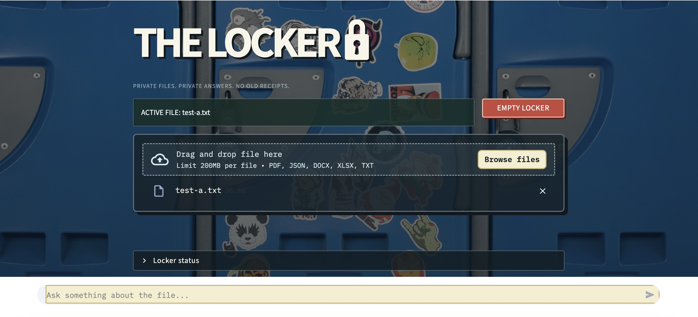

# The Locker 🔒

**Upload a file — or paste text. Ask questions. Keep your stuff private.**



If you want to query your own documents without handing them to somebody else's cloud, this is for you. The Locker runs entirely on your machine with local models: teeny-weeny environmental footprint, no API key, no upload leaving your computer. It's got a cute locker-themed UI, and a built-in hallucination guardrail: The Locker instructs the local model to refuse when the retrieved excerpts do not support an answer, and shows the retrieved excerpts so you can check the answer yourself.

It handles one active source at a time. It shows you what it found and roughly where it came from. It tells you when there's not enough evidence to answer. And when a conversation's actually worth keeping, you can export it — receipts included — as the one deliberate moment data leaves the app.

> One locker. One active source. No old receipts.

## Who it's for

Built for anyone working with sensitive, short-lived, or high-scrutiny material where cloud upload or long-term storage isn't an option — legal and paralegal work (depositions, contracts, discovery), financial analysis (tax forms, balance sheets, earnings reports), journalism (embargoed leaks, FOIA releases, source-sensitive transcripts), healthcare and HR (patient notes, HIPAA/GDPR-bound records) — plus anyone who wants a clean, minimal reference for local RAG without a persistence layer to manage.

## What this is

A small RAG app built around these principles:

- Keeping documents local
- Keeping one upload from bleeding into the next
- Checking what retrieval actually found
- Admitting when there is not enough evidence to answer
- Making the state of the app visible instead of magical

Each new source gets a fresh retrieval collection and clears the prior chat session. The answer prompt instructs the model to use only retrieved excerpts from that active source. Nothing is saved, nothing is inherited from past documents, and nothing leaves the app unless you export it.

## What it does

- Takes one PDF, JSON, DOCX, XLSX, or TXT file — or pasted text — as the active source
- Parses, chunks, and embeds it locally
- Splits JSON into one chunk per top-level list item or dict key, instead of stringifying the whole file into a single blob
- Uses Ollama for local embeddings and chat
- Creates a fresh Chroma collection for every new source
- Clears old chat state when the active source changes
- Re-runs retrieval from scratch on every turn against that ephemeral collection: follow-up questions use local chat history for conversational references, while every turn reruns retrieval against the active source
- Lets you inspect retrieved chunks, including page numbers for PDFs and item paths for JSON, so you're never taking the answer on faith
- Gives an explicit refusal when the source doesn't contain the answer
- Deletes the temporary upload copy after indexing (pasted text never touches disk at all — it's embedded straight from memory)
- Lets you export the full conversation, with receipts, as a Markdown file

## The rule

If The Locker can't find enough evidence in the active source, it should say:

```text
NO RECEIPTS IN THIS LOCKER.

I couldn’t verify that from the retrieved excerpts.
```

## Privacy

The point is that this runs on your machine.

- Ollama runs locally
- No cloud LLM API key required
- No persistent vector database. For a typical single-document workflow, permanently indexed embeddings are unnecessary overhead; keeping memory volatile makes cross-document contamination architecturally impossible
- Each upload is fingerprinted with a local SHA-256 hash, used only to detect when the active source has changed, never transmitted or logged
- Uploads are only written to a temporary local file while they are parsed, then that file is deleted; pasted text skips the temp file entirely
- Vector data stays **in memory only** — there's no `persist_directory` set, so every collection is gone the moment the Streamlit process restarts, not just when you hit "Empty Locker"
- Clearing the locker deletes the active collection and chat history
- Exporting the chat is the only point where data leaves the app, and it only happens when you click the button
- The Locker is designed for local, single-user use. That does not mean "secure in every imaginable deployment." It does not encrypt files at rest, secure the host computer, protect against malware, guarantee model behavior, or make a publicly exposed Streamlit server safe - so please don't tunnel this onto the public internet (ngrok, port forwarding, etc.) without adding auth in front of it!

## Setup

**Requires Python 3.9+**

### 1. Install Ollama

Install [Ollama](https://ollama.com), then pull the two models this app uses:

```bash
ollama pull llama3.2
ollama pull nomic-embed-text
```

If Ollama is not already running:

```bash
ollama serve
```

### 2. Clone the repo

```bash
git clone https://github.com/ardent17/the-locker.git
cd the-locker
```

### 3. Make a virtual environment

```bash
python3 -m venv .venv
source .venv/bin/activate
```

Windows PowerShell:

```powershell
.\.venv\Scripts\Activate.ps1
```

### 4. Install dependencies

```bash
pip install -r requirements.txt
```

### 5. Run it

```bash
streamlit run app.py
```

Streamlit will print a local URL, usually:

```text
http://localhost:8501
```

## Supported sources

| Source | Extension | Parser |
|---|---|---|
| PDF | `.pdf` | PyPDFLoader |
| JSON | `.json` | Custom per-item splitter (one chunk per top-level list item or dict key) |
| Word document | `.docx` | Docx2txtLoader |
| Excel workbook | `.xlsx` | UnstructuredExcelLoader |
| Plain text | `.txt` | TextLoader |
| Pasted text | — | Embedded directly, no file or loader involved |

## Test source isolation

This only matters if you've modified `app.py`. On a fresh clone this will always pass — use it to confirm you haven't broken source isolation while changing the ingestion logic.

Make two files with conflicting information.

`test-a.txt`

```text
The locker combination is 17-04-89.
```

`test-b.txt`

```text
The locker combination is 03-11-02.
```

Then:

1. Upload `test-a.txt`
2. Ask: `What is the locker combination?` or some variation thereof
3. Upload `test-b.txt`
4. Ask the same question
5. Confirm the answer is `03-11-02`
6. Ask for a fact found only in `test-a.txt`
7. The app should refuse, not pull an answer out of the old file

If step 7 fails, isolation's broken: the app answered from a source it should've deleted. How to fix: in `app.py`, find `process_new_source()`. Right before it builds the new vector store, it should call `st.session_state.vector_store.delete_collection()` and reset `chat_history` and `chat_log` to `[]`. If any of those is missing, or happens after the new source is indexed instead of before, that's the bug.

## Stack

- [Streamlit](https://streamlit.io/) for the UI
- [Ollama](https://ollama.com/) for local models
- [LangChain](https://www.langchain.com/) for document loading and retrieval
- [Chroma](https://www.trychroma.com/) for vector search
- `llama3.2` for answers
- `nomic-embed-text` for embeddings

## Project layout

```text
the-locker/
├── app.py
├── requirements.txt
├── README.md
├── .gitignore
└── assets/
```

## V1 checklist

- [x] Local models through Ollama
- [x] One active source at a time
- [x] PDF, JSON, DOCX, XLSX, and TXT support
- [x] Paste-text input, no file or temp storage required
- [x] Fresh vector collection per source
- [x] Chat history scoped to the active source
- [x] Temporary-file cleanup
- [x] Source/page metadata beneath answers, including JSON item paths
- [x] "Behind the locker door" retrieval inspector
- [x] Export chat + receipts as Markdown
- [x] Empty Locker button
- [x] Locker UI skin

## License

MIT